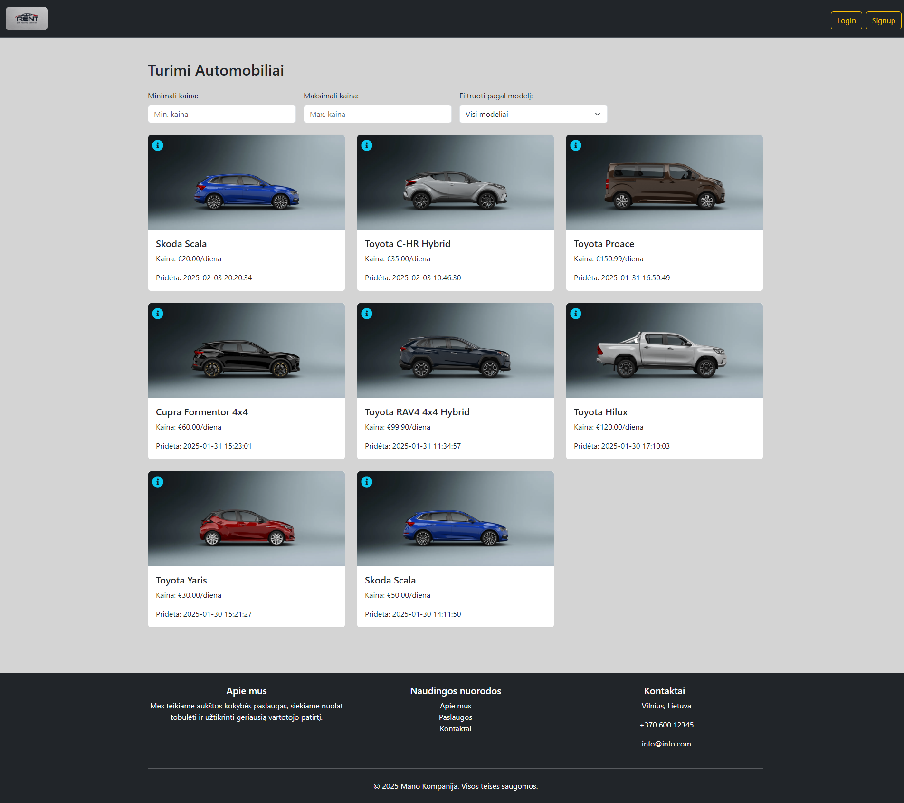

# Projekto dokumentacija - Rent

## Apžvalga

Rent yra įrangos (automobilių) rezervacijos ir valdymo sistema, leidžianti vartotojams rezervuoti ir nuomoti įrangą. Administratoriaus rolė leidžia valdyti ir tvarkyti pasiekiamus įrenginius, o vartotojai gali užsisakyti ir peržiūrėti jų būsenas. Sistema apima dvi pagrindines dalis: administratoriaus ir paprasto vartotojo sąsajas, taip pat turi papildomų funkcijų, kaip išankstinės rezervacijos, apribojimai ir autentifikacija.

# Projekto struktūra ir jos aprašymas

## Struktūra:

```plaintext
rent
├── backend
│   ├── controllers
│   │   ├── authController.js
│   │   ├── carController.js
│   │   └── reservationController.js
│   ├── middleware
│   │   └── upload.js
│   ├── models
│   │   ├── carModel.js
│   │   ├── reservationModel.js
│   │   └── userModel.js
│   ├── routes
│   │   ├── authRoutes.js
│   │   ├── carRoutes.js
│   │   ├── mainRoutes.js
│   │   └── reservationRoutes.js
│   ├── uploads
│   │   └── 1738237673878.png
│   ├── .env
│   ├── .gitignore
│   ├── package-lock.json
│   ├── package.json
│   └── server.js
├── frontend
│   ├── public
│   │   ├── car.png
│   │   ├── logo.png
│   │   └── pick_back.webp
│   ├── src
│   │   ├── assets
│   │   ├── components
│   │   │   ├── CarFilter.jsx
│   │   │   ├── CarForm.jsx
│   │   │   ├── CarInfo.jsx
│   │   │   ├── CarList.jsx
│   │   │   ├── Footer.jsx
│   │   │   ├── Nav.jsx
│   │   │   └── ReservationForm.jsx
│   │   ├── pages
│   │   │   ├── AdminPage.jsx
│   │   │   ├── AllReservedCars.jsx
│   │   │   ├── DetailedInfoPage.jsx
│   │   │   ├── HomePage.jsx
│   │   │   ├── Login.jsx
│   │   │   ├── MyReservationsPage.jsx
│   │   │   ├── NotFound.jsx
│   │   │   └── Signup.jsx
│   │   ├── App.jsx
│   │   ├── index.css
│   │   └── main.jsx
│   ├── tests
│   │   ├── AdminPage.test.js
│   │   ├── AllReservedCars.test.js
│   │   ├── CarForm.test.js
│   │   ├── CarInfo.test.js
│   │   ├── CarList.test.js
│   │   ├── Detailed.test.js
│   │   ├── Home.test.js
│   │   ├── Login.test.js
│   │   ├── MyReservations.test.js
│   │   └── Register.test.js
│   ├── .gitignore
│   ├── babel.config.js
│   ├── eslint.config.js
│   ├── index.html
│   ├── jest.config.js
│   ├── jest.setup.js
│   ├── package-lock.json
│   ├── package.json
│   ├── README.md
│   └── vite.config.js


# Aprašymas:

## Backend
    1. controllers:
        ◦ authController.js: Atsakingas už vartotojo autentifikaciją (registracija, prisijungimas).
        ◦ carController.js: Tvarko užklausas dėl automobilių (pridėjimas, atnaujinimas, peržiūra).
        ◦ reservationController.js: Tvarko rezervacijų logiką (rezervacijų kūrimas, redagavimas, rodymas).
    2. middleware:
        ◦ upload.js: Užtikrina įkeltų failų (pvz., automobilių nuotraukų) valdymą.
    3. models:
        ◦ carModel.js: Apibrėžia automobilių duomenų struktūrą.
        ◦ reservationModel.js: Apibrėžia rezervacijų duomenų struktūrą.
        ◦ userModel.js: Apibrėžia vartotojų duomenų struktūrą.
    4. routes:
        ◦ authRoutes.js: Apibrėžia autentifikacijos maršrutus (registracija, prisijungimas).
        ◦ carRoutes.js: Apibrėžia maršrutus, susijusius su automobilių duomenų valdymu.
        ◦ mainRoutes.js: Pagrindiniai maršrutai, pvz., pagrindinis puslapis.
        ◦ reservationRoutes.js: Apibrėžia maršrutus, susijusius su rezervacijų valdymu.
    5. uploads:
        ◦ Saugo įkeltus failus (pvz., automobilių nuotraukas).
    6. .env: Konfigūracijos failas, kuriame saugomi svarbūs kintamieji (pvz., duomenų bazės jungtys).
    7. .gitignore: Sąrašas failų ir aplankų, kuriuos reikia ignoruoti naudojant Git.
    8. package.json ir package-lock.json: Node.js projekto priklausomybės.
    9. server.js: Pagrindinis serverio failas, kuris paleidžia backendą.

## Frontend
    1. public:
        ◦ Saugo viešus failus, tokius kaip logotipai, nuotraukos ir kiti ištekliai.
    2. src:
        ◦ assets: Grafika ir kiti vizualiniai ištekliai.
        ◦ components: React komponentai:
            ▪ CarFilter.jsx: Filtrų komponentas automobilių paieškai.
            ▪ CarForm.jsx: Forma automobiliui pridėti.
            ▪ CarInfo.jsx: Informacija apie konkretų automobilį.
            ▪ CarList.jsx: Automobilių sąrašas.
            ▪ Footer.jsx: Pora komponentų svetainės apačioje.
            ▪ Nav.jsx: Navigacijos komponentas.
            ▪ ReservationForm.jsx: Rezervacijos formos komponentas.
        ◦ pages:
            ▪ AdminPage.jsx: Administratorius peržiūri ir valdo automobilius ir rezervacijas.
            ▪ AllReservedCars.jsx: Puslapis, kuriame rodomos visos užsakytos transporto priemonės.
            ▪ DetailedInfoPage.jsx: Detali informacija apie automobilį.
            ▪ HomePage.jsx: Pagrindinis puslapis, kuriame rodomi visi automobilių įrašai.
            ▪ Login.jsx: Prisijungimo forma.
            ▪ MyReservationsPage.jsx: Vartotojo rezervacijos.
            ▪ NotFound.jsx: Puslapis, kai nepavyksta rasti nurodyto kelio.
            ▪ Signup.jsx: Registracijos forma.
        ◦ App.jsx: Pagrindinis aplikacijos komponentas.
        ◦ index.css: Globalūs stiliai.
        ◦ main.jsx: Aplikacijos įkrovimas.
    3. tests:
        ◦ Testai, apimantys pagrindinius komponentus ir puslapius, naudojant Jest ir React Testing Library:
            ▪ AdminPage.test.js, CarForm.test.js, Login.test.js, ir kiti.
    4. .gitignore: Sąrašas failų ir aplankų, kuriuos reikia ignoruoti naudojant Git.
    5. babel.config.js: Babel konfigūracija.
    6. eslint.config.js: Linting konfigūracija.
    7. jest.config.js: Jest konfigūracija testavimui.
    8. vite.config.js: Vite konfigūracija React aplikacijai.


# Įdiegimas
    1. Backend:
        ◦ Įdiekite backend priklausomybes:

          npm install

        ◦ Paleiskite serverį:

          npm start

    2. Frontend:
        ◦ Įdiekite frontend priklausomybes:

          npm install

        ◦ Paleiskite frontend aplikaciją:

          npm run dev

# Testavimas

Testavimas (Unit) yra atliktas naudojant Jest ir React Testing Library. Norėdami atlikti testus, naudokite šią komandą:

npm test

# Papildoma informacija
    • Sistema sukurta su React, Node.js / Express, MongoDB. Visos šios dalys sujungtos
      tarpusavyje.
    • Autentifikacija: Sistema naudoja JWT tokenus vartotojų autentifikacijai ir leidžia tik prisijungusiems vartotojams atlikti veiksmus, susijusius su rezervacijomis.
    • Įkėlimas: Failai, įskaitant automobilių nuotraukas, įkeliami per specialų middleware upload.js, kuris užtikrina, kad failai būtų teisingai apdorojami.

-----------------------------------------------------------------------------------------------------------------------

# User Story Map - Rent

Vartotojo istorijų apžvalga
Administratorius
Administratorius turi galimybę kurti, redaguoti ir valdyti įrenginius (automobilius) ir peržiūrėti bei tvarkyti rezervacijas.

Paprastas vartotojas
Paprastas vartotojas gali peržiūrėti įrenginius (automobilius).
Registruotas ir prisijungęs vartotojas gali peržiūrėti įrenginius (automobilius) juos rezervuoti ir matyti savo rezervacijas.

User Story Map

## Pagrindinės funkcijos:

| Veiksmas                          | Administratorius                  | Paprastas vartotojas             |
|-----------------------------------|-----------------------------------|----------------------------------|
| **Prisijungimas**                 | Prisijungia į administratoriaus paskyrą | Prisijungia į vartotojo paskyrą      |
| **Registracija**                  | Nėra                                    | Registruojasi ir sukuria paskyrą    |
| **Peržiūrėti automobilius**       | Peržiūri ir tvarko automobilius        | Peržiūri pasiekiamus automobilius   |
| **Kurti, redaguoti automobilį**   | Kuria ir redaguoja automobilius        | Nėra galimybės                      |
| **Peržiūrėti rezervacijas**       | Peržiūri ir tvarko visų vartotojų rezervacijas | Peržiūri savo rezervacijas           |
| **Kurti rezervaciją**             | Nėra galimybės                        | Rezervuoja automobilį               |
| **Patvirtinti rezervacijas**      | Patvirtina vartotojų rezervacijas      | Nėra galimybės                      |
| **Atsijungimas**                  | Atsijungia nuo administratoriaus paskyros | Atsijungia nuo vartotojo paskyros    |

# Detalesnės istorijos

## Administratorius:
    1. Prisijungimas
        ◦ Kaip administratorius, noriu prisijungti prie savo paskyros, kad galėčiau valdyti automobilius ir rezervacijas.
    2. Automobilių valdymas
        ◦ Kaip administratorius, noriu kurti, redaguoti ir šalinti automobilius iš sistemos, kad galėčiau atnaujinti nuomos pasiūlą.
    3. Rezervacijų patvirtinimas
        ◦ Kaip administratorius, noriu patvirtinti vartotojų rezervacijas, kad užtikrinčiau, jog įrenginiai būtų tinkamai paskirstyti ir nepadarytų klaidų.
    4. Peržiūrėti rezervacijas
        ◦ Kaip administratorius, noriu matyti visas aktyvias ir atliktas rezervacijas, kad galėčiau sekti, kas ir kada nuomojosi įrenginį.

## Paprastas vartotojas:
    1. Registracija ir prisijungimas
        ◦ Kaip vartotojas, noriu užsiregistruoti sistemoje ir sukurti paskyrą, kad galėčiau rezervuoti įrangą ir sekti savo užsakymus.
    2. Automobilių peržiūra
        ◦ Kaip vartotojas, noriu peržiūrėti visus pasiekiamus automobilius, kad galėčiau pasirinkti norimą nuomai.
    3. Rezervacijos kūrimas
        ◦ Kaip vartotojas, noriu rezervuoti automobilį pasirinktam laikui, kad galėčiau naudotis juo pagal mano poreikius.
    4. Peržiūrėti savo rezervacijas
        ◦ Kaip vartotojas, noriu matyti savo atliktas rezervacijas, kad galėčiau stebėti būsimas užsakymų datas ir informaciją.
    5. Atsijungimas
        ◦ Kaip vartotojas, noriu atsijungti nuo savo paskyros, kai baigsiu naudotis sistema.

## Prioritetai

| **Pirmas prioritetas**                | **Antras prioritetas**               | **Trečias prioritetas**               |
|---------------------------------------|--------------------------------------|---------------------------------------|
| 1.1. Prisijungimas                    | 1.4. Kurti, redaguoti automobilį     | 1.5. Peržiūrėti rezervacijas         |
| 1.2. Registracija                     | 1.3. Peržiūrėti automobilius        | 1.7. Patvirtinti rezervacijas        |
| 1.3. Peržiūrėti automobilius          | 1.6. Kurti rezervaciją              | 1.8. Atsijungimas                    |
| 1.6. Kurti rezervaciją                |                                      |                                       |

# Papildomos pastabos:
    • Autentifikacija: Sistema naudoja JWT (JSON Web Token) autentifikaciją tiek administratoriui, tiek vartotojui.
    • Rezervacijos apribojimai: Sistema užtikrina, kad automobilių negalima būtų rezervuoti daugiau nei vienam vartotojui tuo pačiu laiku.
    • Atsarginiai įrašai: Visi įrašai apie automobilių būsenas, rezervacijas ir vartotojus yra saugomi MongoDB duomenų bazėje.   